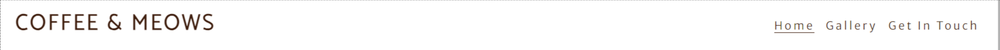
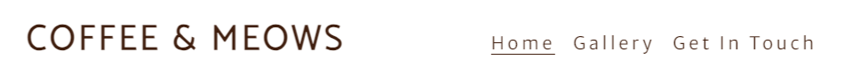
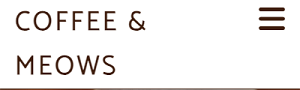
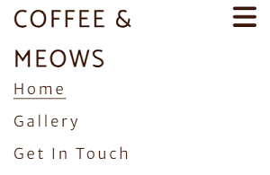
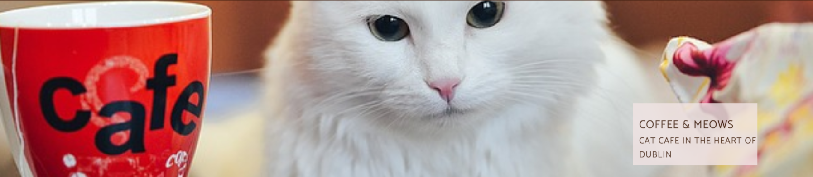
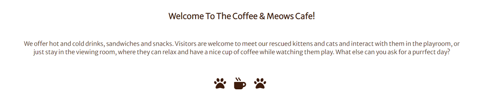
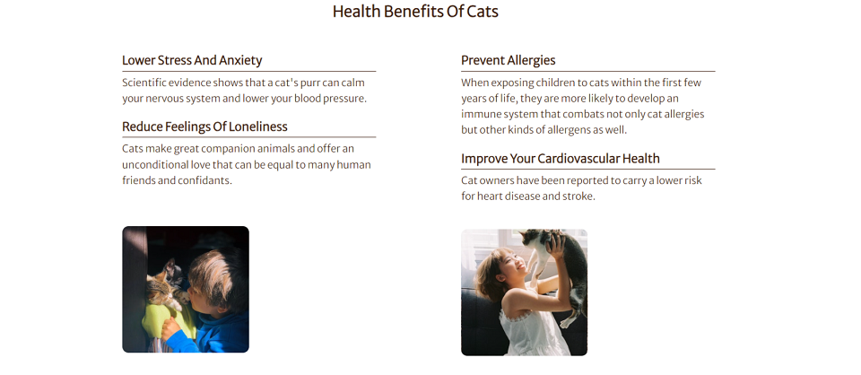
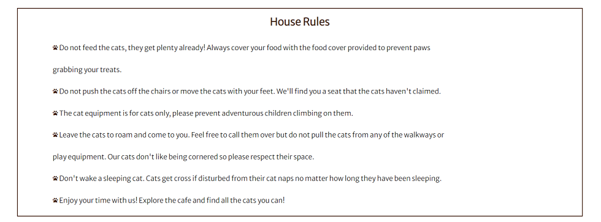
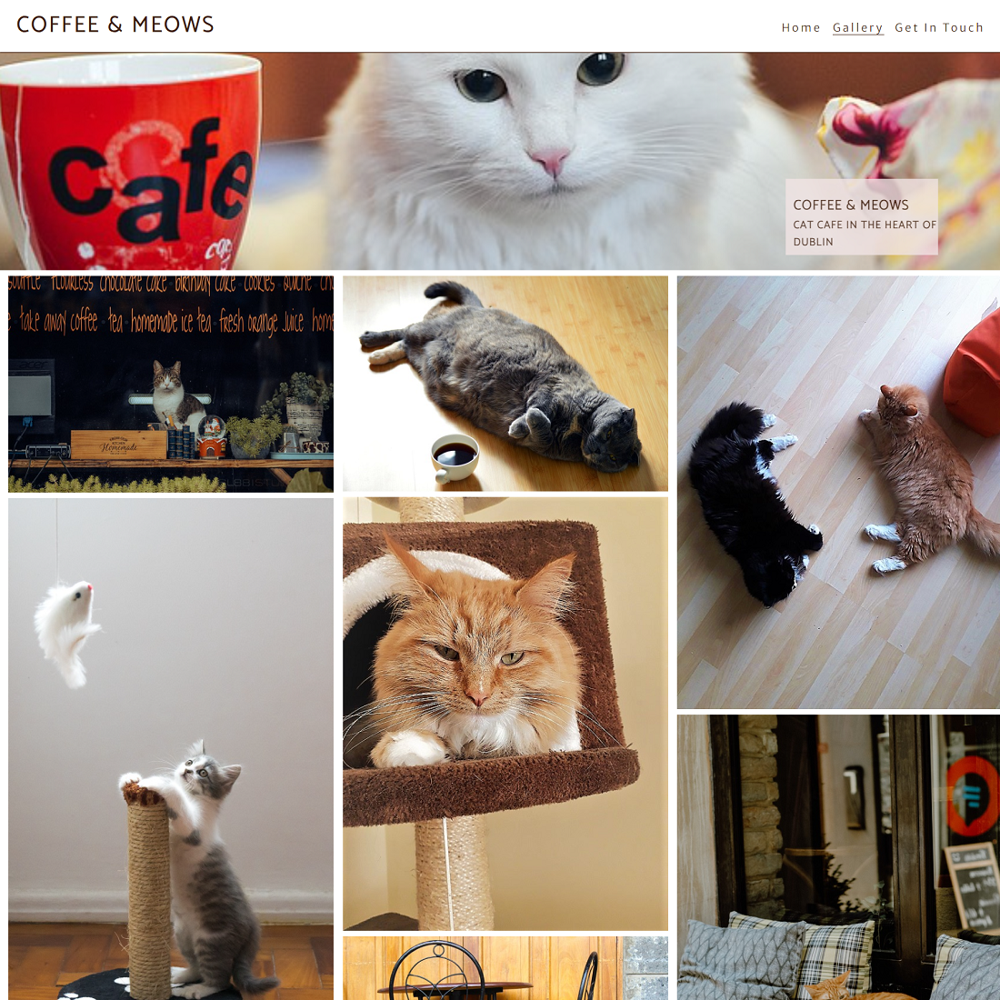
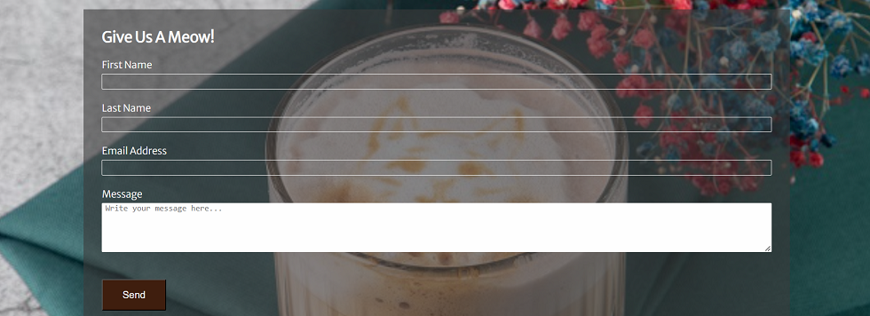

# Coffee & Meows

[Coffee & Meows](https://noeliaci.github.io/coffee-meows) is a website for coffee and cat lovers looking for a space to relax. Visitors can learn what it is offered at the cafe and also about the health benefits of interacting with cats. They can also watch some pictures of the cats and the facilities and get in touch through a contact form.

---

## Features

### Navigation Bar
 
  - Positioned at the top of the page.
  - Contains logo of the cafe on the left side.
  - Navigation links are positioned on the right side:
       * HOME - leads to the home page.
       * GALLERY - leads to the gallery page.
       * GET IN TOUCH - Leads to the get in touch page where the user can fill the contact form.
- The link of the page where the user is currently on is underlined.
- The navigation is clear and easy to understand for the user.
- The navigation bar is responsive for all devices:
   * Desktop

   * Tablet

   * Mobile
  
 

     When the user clicks on the hamburger icon the menu expands.

---

### Hero Section

* The hero section introduces the user to Coffee & Meows website with an animated background image to get their attention.
* The hero section includes a cover text and box with the logo and a brief description of the business.

---

### Home Page

  #### Welcome Section
  * This section welcomes the user an gives an insight of what type of drinks and food can be found at the cafe.
  * The welcome section includes animated icons of paws and coffee cup.
  

  

  
#### The Health Benefits Of Cats Section
  * This section gives the user some information about the benefits being around cats could bring to your health.
  * The health benefits of cats section displays in two columns on desktops and large screens and in one column on tablets and mobiles.
  * The health benefits of cats section contains four explained health benefits and two images of people interacting with cats.
  

  
#### House Rules Section
  * The House rules section will give the user the guidelines for the best and safest experience when visiting the cafe.
  * The house rules section contains a list with paw icons inside a box.
  

  
#### Footer
  * The footer section includes information about opening times, contact details and social links.
  * The footer displays in three columns on desktops and tablets, and in one column on mobile devices.
  * This section is featured on all three pages.

### Gallery Page
  * The gallery provides the user with supporting images to see what the cafe environment looks like.
  * It allows the user to meet some of the cats they will find at the cafe.
  * The gallery is responsive and it displays in three columns on desktops and tablets, and in one column on mobile devices.

#### Get In Touch Page
  * The get in touch page will allow the user to contact the cafe for suggestions, queries or anything they need.
  * It contains a form with:
    * Inputs for first name, last name and e-mail address.
    * Text area for the user to write a message.
    * Submit button to send the completed form.
- Submitting the form leads to the hidden response page that contains thank you message.
  

  
### Features Left to Implement

* Donation button.
* Adoption form.

## Testing

## Deployment

## Credits
