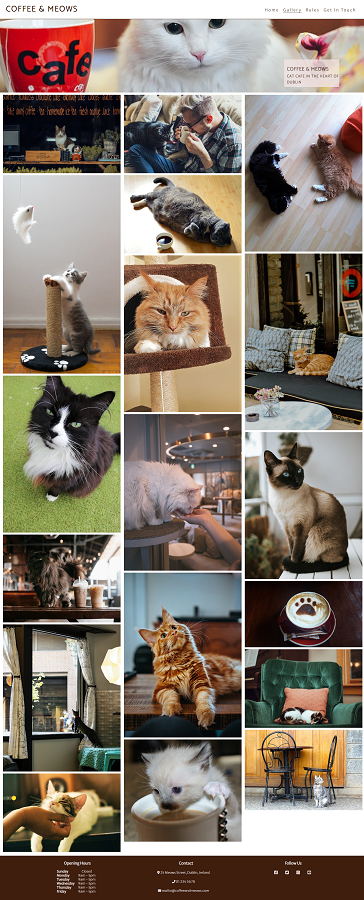
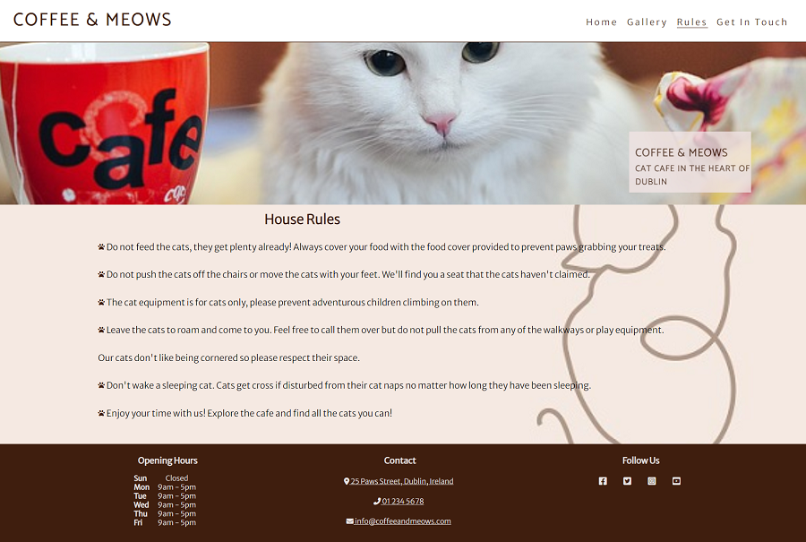
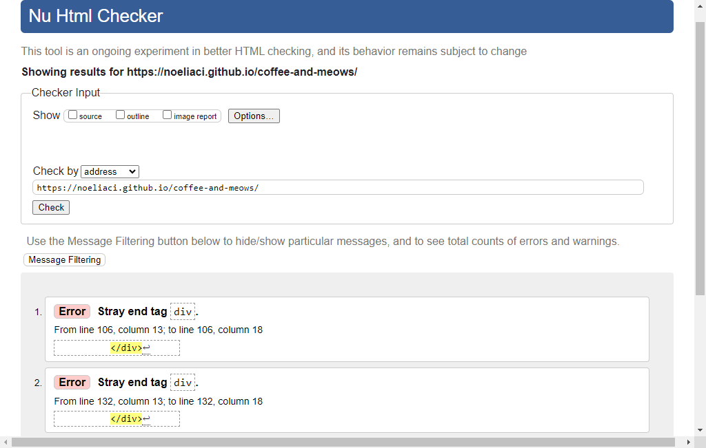
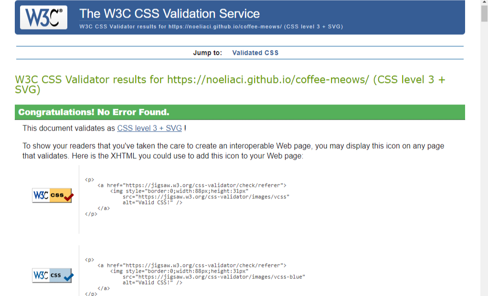
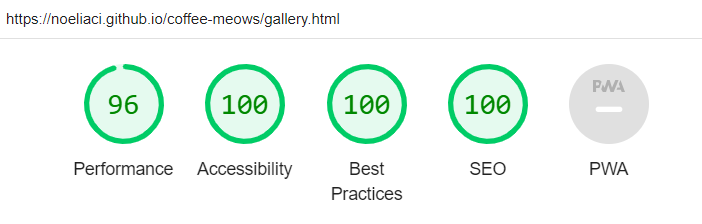
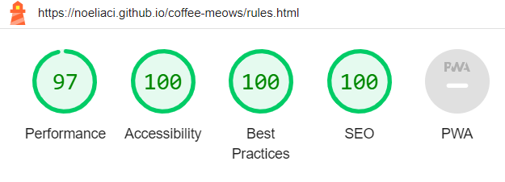
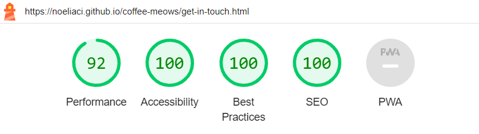
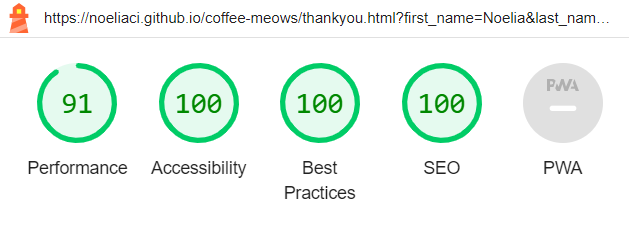

# Coffee & Meows

[Coffee & Meows](https://noeliaci.github.io/coffee-meows) is a website for coffee and cat lovers looking for a space to relax. Visitors can learn what it is offered at the cafe and about the health benefits of interacting with cats. They can also watch some pictures of the cats and the facilities and get in touch through a contact form.

---
## User Stories

### First Time User Goals
* As a first time user, I want to understand the purpose of the website, so I can learn about the business offered.
* As a first time user, I want to easily navigate through the website, so I can quickly find the information I need.
* As a first time user, I want to locate the opening times, so I can plan a visit.

### Returning User Goals
* As a returning user, I want to see a gallery, so I can see the cats they have at the cafe.
* As a returning user, I want to learn about the rules at the cafe, so I can have a better experience when visiting.
* As a returning user, I want the website to have a contact form, so I can contact the cafe if needed.

### Frequent User Goals
* As a frequent user, I want the website to be responsive, so I can visit it from different devices.

## Features

### Navigation Bar
 
  - Positioned at the top of the page.
  - Contains the logo of the cafe on the left side.
  - Navigation links are positioned on the right side:
       * HOME - leads to the home page.
       * GALLERY - leads to the gallery page.
       * RULES - leads to the house rules page.
       * GET IN TOUCH - leads to the get in touch page where the user can fill the contact form.
- The link of the page where the user is currently on is underlined.
- The navigation is clear and easy to understand for the user.
- The navigation bar is responsive for all devices:
   * Desktop

   * Tablet

   * Mobile
  
 

     When the user clicks on the hamburger icon the menu expands.

---

### Hero Section

* The hero section introduces the user to Coffee & Meows website with an animated background image to get their attention.
* The hero section includes a cover text and box with the logo and a brief description of the business.

---

### Home Page

  #### Welcome Section
  * This section welcomes the user and gives an insight of what type of drinks and food can be found at the cafe.
  * The welcome section includes animated icons of paws and a coffee cup.
  

  
#### Menu Section
* The menu section shows the user the variety of drinks and food that can be purchased at the cafe.
* The menu section contains three items which display in one column on mobile phones and in three columns on tablets and desktops.
  

  
#### The Health Benefits Of Cats Section
  * This section gives the user some information about the benefits being around cats could bring to your health.
  * The health benefits of cats section displays in two columns on desktops and large screens and in one column on tablets and mobiles.
  * The health benefits of cats section contains four explained health benefits and two images of people interacting with cats.
  
  
  
#### Footer
  * The footer section includes information about opening times, contact details and social links.
  * The footer displays in three columns on desktops and tablets, and in one column on mobile devices.
  * This section is featured on all three pages.

---

### Gallery Page
  * The gallery provides the user with supporting images to see what the cafe environment looks like.
  * It allows the user to meet some of the cats they will find at the cafe.
  * The gallery is responsive and it displays in three columns on desktops and tablets, and in one column on mobile devices.

---

### House Rules Page

* The House rules page will give the user the guidelines for the best and safest experience when visiting the cafe.
* The house rules page contains a list with paw icons over a cat themed background.
  

---

### Get In Touch Page
  * The get in touch page will allow the user to contact the cafe for suggestions, queries or anything they need.
  * It contains a form with:
    * Inputs for first name, last name and e-mail address.
    * Text area for the user to write a message.
    * Submit button to send the completed form.
- Submitting the form leads to the hidden response page that contains a thank you message.
  

---
  
### Features Left to Implement

* Donation button.
* Adoption form.
---
  
### Technologies Used

* HTML
* CSS
* Google Fonts
* Favicon
* Font Awesome Icons

---

# Testing

* I tested that this web page works in different browsers: Chrome, Firefox, Safari.
* I used devtools device toolbar to confirm that the website is responsive and looks good on all standard screen sizes.
* I tested all the links and confirmed that they work and lead where they should.
* I tested the contact form: confirmed that the error messages appear when the fields are empty, that the submit button works and that once submitted leads to the response page.

## Validator Testing
* HTML
  * Two errors were initially found related to stray closing tags. After fixing this, no more errors were found when passing through the official W3C validator.
  

CSS* CSS
  * No errors were found when passing through the official Jigsaw validator.

## Lighthouse Testing
* I confirmed that the colors and fonts chosen are accessible by running it through lighthouse in devtools.
  
   * Home Page 
  

   * Gallery Page
  
  
   * House Rules Page
  

   * Get In Touch Page
  
  
   * Thank You Page
  

### Bugs
#### Solved bugs
* After deploying the website I found out that the images were broken in the gallery page. This was due to absolute file paths. I fixed it by removing the initial slash and making the file paths relative.

#### Unsolved bugs
* None.
---
# Deployment
* This website was deployed to GitHub pages. The steps to deploy are the following:
  * In the [GitHub repository](https://https://github.com/NoeliaCI/coffee-meows), go to the settings tab.
  * Select the Main Branch from the source menu and click save.
  * The page will refresh and a message with successful deployment will display if anything went wrong.
* The website can also be accessed by the live link here: [Coffee & Meows](https://noeliaci.github.io/coffee-meows/)

## Credits
